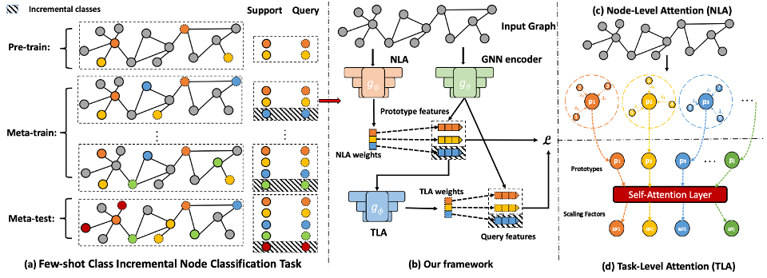

# Graph Few-shot Class-incremental Learning (WSDM 2022)

## Requirements
`python==3.7.10`

`pytorch==1.8.1`

`cuda=11.1`

## Useage
### Go to the directory
`cd incremental`
### Pretrain
`python pretrain.py --use_cuda --dataset Amazon_clothing` 
### Meta-train and Evaluation 
`python meta_train.py --use_cuda --dataset Amazon_clothing --episodes 1000 --incremental --checkpoint 100 --way 3` 

You may need to change the pretraining checkpoint number according to your need or result.
